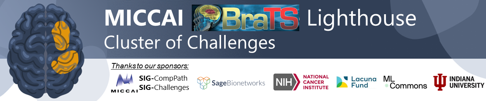

# Frequency-Aware Ensemble Learning for BraTS 2025 Pediatric Brain Tumor Segmentation

🚩**News** (2025.11) The source code of our solution have been released.

🚩**News** (2025.10) Our solution achieves **🥇rank 1st** in the
BraTS 2025 Pediatric Brain Tumor Segmentation Challenge.

🚩**News** (2025.09) We are invited to give an **oral presentation** during the *MICCAI BraTS 2025 Challenge Workshop* on 23 September 2025.
